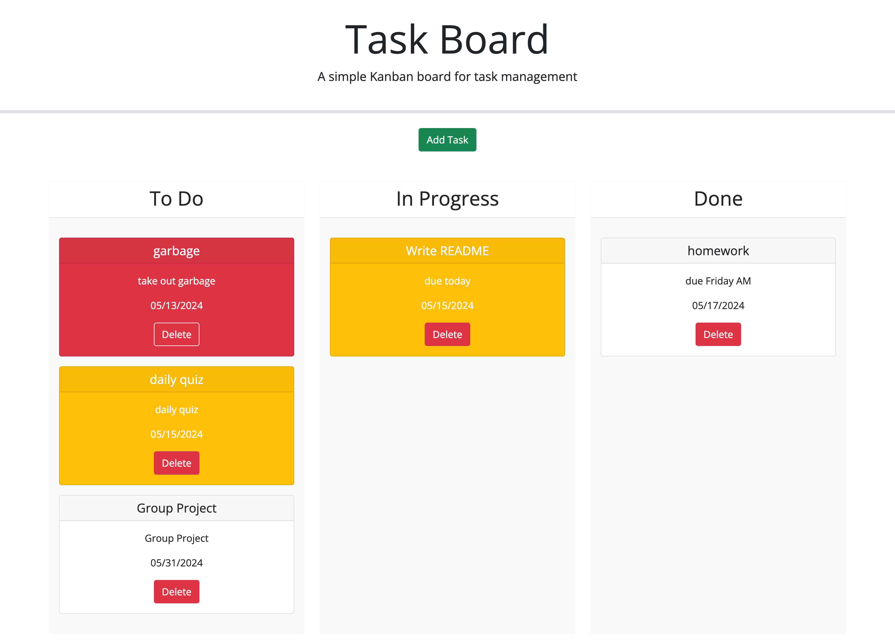

# Task-Board

## Description

This task board was created as a way to organize tasks in three categories: to do, in progress, and done.  The application provides visual cues for the priority by due-date: white for a project due in the future or already done, yellow for due today, and red for past due, automatically rendered by the application.  The user, after entering as many tasks as they'd like, can move the task cards around between columns to keep track of their work.  When the project is no longer needed on the radar, the user can choose to delete the task, and it will disappear from the task board.

This challenge involved more moving pieces than I had ever dealt with before, literally and figuratively.  It was a slow start after the easy addition of a Bootstrap modal and adding a Jquery UI datepicker to the modal.  After a few slight modifications, the modal was ready to go and the rest of the project was figuring out how to make javascript make the page work.  I started with the handleAddTask function to incorporate the user-entered information to create a task object and push the tasks to an array.  The array is saved in local storage and heavily accessed through the rest of the project.  From here the goal was to get the tasks to show up on the screen like they were supposed to.  This process required two functions to use the information from local storage: createTaskCard and renderTaskCard.  Create task card handled creating all the html elements and assigning them to bootstrap classes to style, with a few conditions to determine the color of the card based on the due date input by the user.  From there, the createTaskCard function returned the task card, which was then used by renderTaskList, to append the card to the to-do column to start out.  

I had a lot of difficulty surrounding the renderTaskCard function and realizing when to call it.  When I was finally able to get the tasks to appear on screen, it would create duplicates when I added a new task.  Removing a call to the renderTaskCard function in the handleAddTask function then required a refresh for the cards to appear on the screen.  The solution was to empty the task board each time the renderTaskCard function is called.  Another roadblock I encountered was successfully dragging and dropping the cards into their respective columns.  It ultimately required accessing the card by the unique ID created in the generateTaskId function and added as a data-attribute during the card creation process, ensuring the ID for the card matched the ID from the object, changing the status of the object, and appending to the correct new column based on the ID of the column matching the status state of the card/object.  

It was difficult at first to comprehend all the different functions and how they would work together, but as I got deeper into the project it became clear that I'd already written the code to do what I needed to do, I just needed to make the components talk to each other at the right moments and pass along the right information to extract the piece I needed to get the task board running.  

## Installation

N/A

## Usage

To use the Task Board application, simply navigate to the link below.  The user is presented with a blank task board.  By clicking the "Add Task" button, a modal pops up on the screen and prompts the user to fill in some information:  A title for the task, a date (a datepicker makes selecting a date easy), and a description of the task.  Confirming "Add Task" again saves the task and it appears on the screen in the To Do column.  At this point, the user can continue to add as many tasks as they'd like.  A task due in the future will remain white, a task due today will be yellow, and a past-due task will be a threatening red.  The user can drag and drop cards into the In Progress column or to the Done column.  All task cards placed in the done column will turn white regardless of the color they were before.  Refreshing the page at any point will not change the position of any of the cards.  When the task is no longer needed on the board, the user can click the red "Delete" button and the task will be deleted. The user can continue to add tasks at any time.     

Click [here](https://lindsay-terry.github.io/task-board/) to view deployed application.

## Credits

Utilized third party libraries Bootstrap, Jquery, dayjs, and Jquery UI.

## License

N/A

